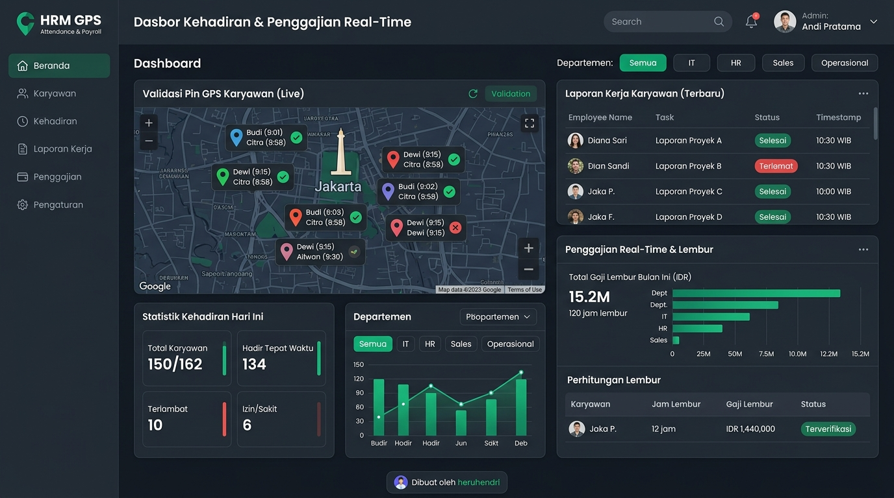

# 🏢 Sistem Presensi & Penggajian Karyawan GPS Real-Time

> **Aplikasi Human Resource Management (HRM) & Payroll terpadu berbasis Web dengan verifikasi presensi Geolocation GPS berakurasi tinggi, monitoring karyawan live real-time, visualisasi peta check-in/check-out, kalkulasi lembur bertingkat & lembur tanggal merah, laporan kerja harian dengan rekomendasi manajerial, pengaturan profil perusahaan & nama aplikasi, sinkronisasi Google Sheets, serta ekspor dokumen resmi PDF dan Excel.**
>
> ⚡ **Dibuat oleh: heruhendri**

---

[](https://github.com/)
[](https://react.dev/)
[](https://www.typescriptlang.org/)
[](https://vitejs.dev/)
[](https://tailwindcss.com/)
[](./LICENSE)

---

## 📸 Pratinjau Antarmuka Aplikasi



*Antarmuka responsif berkecepatan tinggi dengan integrasi Geolocation GPS, peta interaktif geofence, monitoring live, analitik grafis kehadiran, serta cetak slip gaji otomatis.*

---

## 🌟 Tentang Aplikasi

Aplikasi **Sistem Presensi & Penggajian Karyawan GPS** dirancang untuk menjawab tantangan tata kelola kehadiran kerja modern pada perusahaan, kantor instansi, dan UMKM tanpa ketergantungan pada perangkat biometrik/fingerprint fisik yang rentan rusak dan berbiaya mahal.

Dengan memanfaatkan sensor **HTML5 Geolocation API** dan formula geodetik **Haversine**, sistem memverifikasi jarak fisik karyawan secara presisi terhadap radius koordinat kantor resmi (*geofencing*). Karyawan hanya dapat melakukan *check-in* saat terbukti berada di area kantor, sementara karyawan dinas luar dapat mengajukan presensi remote dengan persetujuan manajerial.

Selain presensi, sistem ini bertindak sebagai mesin penggajian otomatis (*payroll engine*) yang menghitung upah lembur bertingkat sesuai UU Ketenagakerjaan No. 13/2003 & PP No. 35/2021, kompensasi lembur hari libur nasional, potongan keterlambatan per menit, tunjangan transport/makan, hingga pencetakan dokumen resmi PDF dan buku kerja Excel multi-sheet.

Seluruh elemen antarmuka, bilah navigasi, footer sistem, dokumen cetak PDF, dan berkas Excel secara konsisten memuat tanda resmi: **"Dibuat oleh heruhendri"**.

---

## 🚀 Fitur-Fitur Lengkap (Feature Overview)

### 1. 📍 Presensi Geolocation GPS & Geofencing Presisi
- **Validasi Jarak Otomatis**: Menghitung jarak meter antara posisi perangkat karyawan dan koordinat kantor secara langsung.
- **Radius Fleksibel**: Admin bebas mengatur batas geofence kantor (default: 100 meter, dapat diatur 20m–500m+).
- **Anti-Kecurangan Geofence**: Tombol absensi terkunci otomatis jika koordinat GPS berada di luar radius kantor yang sah.
- **Pendeteksi Akurasi Satelit**: Menampilkan radius akurasi meter dari sensor GPS perangkat guna mencegah manipulasi *mock location*.
- **Tugas Luar & Remote (WFH/Dinas)**: Modal izin khusus untuk karyawan dinas lapangan atau tugas luar kota yang membutuhkan otorisasi admin.

### 2. 🗺️ Visualisasi Peta Presensi GPS (Check-in & Check-out Maps)
- **Peta Interaktif Terintegrasi**: Memetakan pusat kantor, batas zona geofence lingkaran hijau, dan posisi karyawan.
- **Dua Titik Koordinat Presensi**:
  - 🟢 **Pin Hijau**: Posisi GPS saat karyawan melakukan *Check-In* masuk kerja.
  - 🔵 **Pin Biru / Oranye**: Posisi GPS saat karyawan melakukan *Check-Out* pulang kerja.
- **Detail Pin Lengkap**: Klik pin pada peta untuk melihat nama, waktu pencatatan, jarak ke kantor, akurasi sinyal, dan tautan langsung ke Google Maps Satelit.
- **Fitur Navigasi Peta**: Tombol *Zoom In*, *Zoom Out*, *Reset View (Center Office)*, serta fokus otomatis pada karyawan terpilih.
- **Tersedia untuk Semua Pengguna**: Dapat diakses baik oleh Administrator di dashboard maupun oleh Karyawan di portal pribadi.

### 3. 🔴 Live Monitoring Karyawan Real-Time
- **Saklar Monitoring Interaktif**: Admin dapat mengaktifkan atau menonaktifkan (*Turn ON/OFF*) pemantauan live sesuai jam operasional kantor.
- **Empat Kategori Status Kehadiran**:
  - 🟢 **Sedang Bekerja**: Karyawan telah check-in dan berada aman di dalam radius kerja.
  - 🔴 **Di Luar Radius**: Karyawan terdeteksi check-in di luar area kantor resmi.
  - 🔵 **Sudah Selesai**: Karyawan telah menyelesaikan absensi pulang hari ini.
  - ⚪ **Belum Hadir**: Karyawan yang belum melakukan absensi pada hari berjalan.
- **Kontrol Keaktifan Akun (Active/Inactive Toggle)**: Kemudahan menonaktifkan atau mengaktifkan kembali akun/status karyawan kapan pun dengan satu klik.
- **Aksi Cepat Intervensi**: Admin dapat langsung mengirimkan peringatan push ke karyawan atau melacak posisi mereka di peta.

### 4. 🏢 Profil Perusahaan & Kustomisasi Branding Nama Aplikasi
- **Branding Sistem Bebas**: Admin dapat mengubah **Nama Aplikasi** (misal: *Sistem Presensi GPS Nusantara*, *HR Portal Pro*), **Slogan / Tagline**, dan **Versi Sistem**.
- **Identitas Legal Perusahaan**: Pengaturan nama resmi entitas (PT/CV), bidang industri, nomor NPWP perusahaan, dan email notifikasi admin.
- **Kontak & Lokasi Kantor**: Alamat fisik kantor lengkap, kota, kode pos, nomor telepon HRD, email resmi, dan alamat website.
- **Pimpinan Penandatangan Dokumen**: Nama pimpinan/direktur penandatangan slip gaji dan jabatan resmi (misal: *Direktur Utama*, *Head of HR & Finance*).
- **Logo Perusahaan**: Mendukung unggah logo langsung dari perangkat (disimpan lokal dalam format aman) atau via URL eksternal.
- **Preset Pengisian Cepat**: Tersedia tombol preset profil instan untuk PT Nusantara Sinergi Utama, PT Teknologi Maju Bersama, dan CV Karya Mandiri Digital.
- **Pratinjau Langsung (Live Preview)**: Tampilan visual pratinjau header navbar, kop surat dokumen cetak, dan footer sistem secara real-time.

### 5. ⏱️ Mesin Lembur Bertingkat & Lembur Hari Libur Nasional
- **Formula Tiered Overtime (Regulasi Ketenagakerjaan)**:
  - Jam ke-1: Kelipatan **1.5x** upah per jam.
  - Jam ke-2 dan seterusnya: Kelipatan **2.0x** upah per jam.
  - Multiplier dan batas jam dapat disesuaikan fleksibel oleh HRD.
- **Kompensasi Lembur Hari Libur (Holiday Overtime)**:
  - Deteksi otomatis tanggal merah dan hari libur nasional Indonesia.
  - Pengali lembur khusus hari libur (kelipatan hingga **2.0x – 3.0x**).
- **Standar Pembagi Jam Kerja**: Mendukung pembagi jam kerja bulanan standar (default **173 jam**) atau kustomisasi sesuai kesepakatan kerja bersama.
- **Workflow Persetujuan Lembur**: Pengajuan lembur melalui laporan kerja harian dengan mekanisme verifikasi (*Approve/Reject*) oleh supervisor/admin.

### 6. 💰 Estimasi Gaji Real-Time (Take Home Pay)
- **Komponen Penghasilan (Earnings)**:
  - Gaji Pokok (*Basic Salary*).
  - Tunjangan Jabatan / Tetap.
  - Uang Makan & Transport Harian (dihitung proporsional berdasarkan kehadiran aktual).
  - Upah Lembur Hari Kerja & Lembur Tanggal Merah.
- **Komponen Potongan (Deductions)**:
  - Denda keterlambatan presisi berbasis menit (misal: Rp 1.000 / menit).
  - Potongan ketidakhadiran / mangkir kerja (*unpaid leave*).
- **Periode Cut-Off & Penggajian**: Pengaturan tanggal tutup buku bulanan dan tanggal pembayaran gaji yang dapat disesuaikan.
- **Pratinjau Slip Gaji**: Karyawan dapat melihat proyeksi pendapatan bersih (*Take Home Pay*) mereka secara transparan.

### 7. 📝 Laporan Pekerjaan Harian & Rekomendasi Manajerial (Work Reports)
- **Kewajiban Laporan Kerja**: Karyawan mengisi ringkasan pekerjaan harian sebelum melakukan presensi pulang (*check-out*).
- **Detail Laporan**: Judul pekerjaan, rincian aktivitas yang diselesaikan, persentase progres harian (0%–100%), serta kendala yang dihadapi.
- **Advisor Rekomendasi Pintar**: Sistem secara otomatis mengevaluasi ketercapaian target harian dan menyajikan rekomendasi tindak lanjut bagi manajer.
- **Persetujuan & Catatan Evaluasi**: Administrator dapat memberikan nilai persetujuan dan umpan balik (*feedback*) bagi setiap karyawan.

### 8. 📅 Manajemen Karyawan, Multi-Shift & Jam Kerja
- **Manajemen Karyawan Lengkap**: Tambah, ubah, nonaktifkan, dan hapus karyawan (disertai modal konfirmasi aman pencegah salah hapus).
- **Dukungan Multi-Shift**:
  - Shift Pagi (08:00 – 17:00)
  - Shift Siang (13:00 – 21:00)
  - Shift Malam (21:00 – 06:00)
  - Shift Fleksibel / Khusus
- **Toleransi Keterlambatan**: Ambang batas toleransi keterlambatan (misal: 15 menit) sebelum denda mulai diberlakukan.

### 9. 📄 Ekspor Dokumen Resmi (PDF & Excel XLSX)
- **Slip Gaji Karyawan (PDF)**:
  - Format resmi dan rapi (*confidential*) lengkap dengan kop surat perusahaan, alamat, NPWP, dan logo.
  - Tabel rincian penghasilan dan potongan, nominal terbilang, dan tanda tangan direktur.
  - Dilengkapi watermark resmi: **"Dibuat oleh heruhendri"**.
- **Laporan Rekapitulasi Gaji Departemen (PDF Landscape)**:
  - Laporan cetak rekapitulasi komprehensif per departemen untuk arsip audit dan manajemen.
- **Workbook Spreadsheet Excel (XLSX)**:
  - Berkas spreadsheet multi-sheet: `Rekap Penggajian`, `Log Presensi GPS`, `Master Karyawan`, dan `Info Sistem`.

### 10. 📊 Visualisasi & Analitik Performa (Recharts)
- **Grafik Tren Kehadiran**: Tren kehadiran harian dan mingguan dalam bentuk grafik batang dan garis.
- **Distribusi Presensi Departemen**: Analisis tingkat kepatuhan dan ketepatan waktu per divisi.
- **Matriks Lembur & Produktivitas**: Visualisasi perbandingan jam lembur dan efisiensi kerja karyawan.

### 11. 🔄 Integrasi Database Google Sheets
- **Sinkronisasi Dua Arah**: Kirim data absensi, pengajuan lembur, dan rekap penggajian langsung ke Google Sheets.
- **Dukungan Google Apps Script**: Kemudahan konfigurasi Webhook URL Apps Script dan Sheet ID langsung dari dashboard admin.

### 12. 🔐 Keamanan, Otentikasi No Auto-Login & Ganti Password Admin
- **Kebijakan Sesi Aman (No Auto-Login)**: Aplikasi membuka sesi dalam keadaan aman/terkunci saat halaman dibuka atau di-refresh untuk mencegah akses tanpa izin pada perangkat bersama.
- **Modal Ganti Kredensial Admin**: Admin dapat memperbarui username dan kata sandi admin secara mandiri dengan verifikasi kata sandi lama.
- **Pemisahan Peran Tegas (Role-Based Access Control)**: Memisahkan tampilan dan hak akses antara Administrator HRD dan Karyawan.
- **Pusat Notifikasi & Log Email**: Log riwayat notifikasi email peringatan absensi dan slip gaji yang terkirim ke karyawan.

---

## 🛠️ Arsitektur & Tumpukan Teknologi (Tech Stack)

| Lapisan / Modul | Teknologi | Fungsi & Keunggulan |
|---|---|---|
| **Frontend Framework** | React 19 (`react` & `react-dom`) | Komponen modular modern, hooks terstandar, dan performa render cepat |
| **Bahasa Pemrograman** | TypeScript 5.8 | Tipe data ketat (*strict types*) untuk keamanan runtime maksimal |
| **Bundler & Server** | Vite 6.2 | *Hot Module Replacement*, build produksi cepat, dan konfigurasi ringan |
| **Styling & CSS** | Tailwind CSS 4.1 | Utility-first styling modern dengan skema warna yang ramah mata |
| **Ikon Antarmuka** | Lucide React | Pustaka ikon SVG konsisten, modern, dan ringan |
| **Pembuatan PDF** | jsPDF & jsPDF-AutoTable | Pembuatan slip gaji dan laporan rekapitulasi PDF berformat resmi |
| **Pengolah Spreadsheet** | SheetJS (`xlsx`) | Generator workbook Excel (.xlsx) multi-sheet langsung di browser |
| **Grafik & Data Viz** | Recharts 3.10 | Komponen diagram batang, garis, dan area interaktif yang responsif |
| **Sensor Lokasi** | HTML5 Geolocation API | Pengambilan titik koordinat lintang & bujur GPS perangkat secara real-time |
| **Penyimpanan Lokal** | Browser `localStorage` | Persistensi data lokal yang andal dan langsung aktif tanpa konfigurasi DB rumit |

---

## 🔑 Kredensial Pengujian (Demo Accounts)

Untuk mempermudah eksplorasi seluruh fitur, berikut adalah akun default yang telah disiapkan:

| Peran | Username / ID | Password | Departemen & Jabatan |
|---|---|---|---|
| **Administrator HRD** | `admin` | `admin123` | Akses penuh ke seluruh menu admin, penggajian, peta GPS, dan profil perusahaan |
| **Karyawan 1** | `EMP-001` | *(Pilih di tab Karyawan)* | **Budi Santoso** — Software Engineer (IT & Engineering) |
| **Karyawan 2** | `EMP-002` | *(Pilih di tab Karyawan)* | **Siti Rahma** — Finance Officer (Keuangan) |
| **Karyawan 3** | `EMP-003` | *(Pilih di tab Karyawan)* | **Ahmad Fauzi** — Sales Supervisor (Pemasaran & Penjualan) |
| **Karyawan 4** | `EMP-004` | *(Pilih di tab Karyawan)* | **Dewi Lestari** — HR Specialist (Human Resources) |

> 💡 *Catatan: Administrator dapat mengubah kata sandi kapan saja melalui tombol **"Ganti Password Admin"** di bilah navigasi.*

---

## 📖 Panduan Penggunaan Lengkap (User Manual)

### A. Alur Kerja Karyawan

1. **Masuk ke Portal Karyawan**:
   - Buka aplikasi pada browser perangkat (laptop atau smartphone).
   - Klik tombol **"Buka Formulir Masuk (Login)"**.
   - Pilih tab **"Karyawan"**, lalu pilih nama Anda pada daftar yang tersedia.
   - Klik **"Masuk Sebagai Karyawan"**.

2. **Melakukan Presensi Masuk (Check-In GPS)**:
   - Berikan izin akses lokasi (*Allow Location*) ketika peramban memintanya.
   - Sistem akan mengukur jarak Anda ke kantor:
     - Radar **Hijau** (*Di Dalam Radius*): Tombol **"Check-In Sekarang"** akan menyala hijau dan dapat diklik.
     - Radar **Kuning/Merah** (*Di Luar Radius*): Tombol terkunci untuk memastikan presensi dilakukan di area kantor.
   - Klik tombol **"Check-In Sekarang"**. Waktu masuk dan titik koordinat GPS Anda akan langsung dicatat.

3. **Melihat Titik Presensi di Peta GPS**:
   - Buka tab **"Peta Presensi GPS"** untuk memverifikasi titik lokasi check-in Anda pada visualisasi geofence kantor.

4. **Mengisi Laporan Kerja & Melakukan Presensi Pulang (Check-Out)**:
   - Saat jam kerja berakhir, klik tombol **"Check-Out Pulang"**.
   - Dialog pengisian **Laporan Pekerjaan Harian** akan muncul secara otomatis.
   - Lengkapi judul pekerjaan, poin capaian tugas hari ini, persentase progres kerja (0%–100%), dan kendala jika ada.
   - Klik **"Kirim Laporan & Check-Out"**. Presensi pulang berhasil dicatat.

5. **Mengunduh Slip Gaji (PDF)**:
   - Buka tab **"Slip Gaji"** pada portal karyawan.
   - Periksa rincian gaji pokok, tunjangan, lembur, dan potongan keterlambatan.
   - Klik tombol **"Unduh Slip Gaji (PDF)"** untuk mengunduh dokumen slip gaji resmi ber-watermark **heruhendri**.

---

### B. Alur Kerja Administrator HRD

1. **Masuk ke Dashboard Admin**:
   - Pada modal login, pilih tab **"Admin HRD"**.
   - Masukkan Username (`admin`) dan Password (`admin123`).
   - Klik tombol **"Buka Dashboard Admin HRD"**.

2. **Memantau Karyawan Secara Real-Time (Live Dashboard)**:
   - Pilih tab **"Live Karyawan"** di menu navigasi atas.
   - Gunakan saklar **Status Monitoring** (Aktif / Nonaktif) untuk memulai sesi pemantauan.
   - Pantau status karyawan (*Sedang Bekerja*, *Di Luar Radius*, *Sudah Pulang*, *Belum Hadir*).
   - Klik tombol **"Peta GPS"** pada karyawan mana pun untuk langsung melacak posisinya.

3. **Menganalisis Titik Presensi pada Peta Geofence**:
   - Buka tab **"Peta Presensi GPS"**.
   - Amati persebaran pin check-in (hijau) dan check-out (biru) seluruh karyawan terhadap zona batas kantor.
   - Periksa akurasi GPS dan jarak meter pada setiap titik pencatatan.

4. **Mengelola Profil Perusahaan & Branding Aplikasi**:
   - Buka tab **"Profil & Nama Aplikasi"** (atau klik tombol *Profil Perusahaan* di Navbar).
   - Sesuaikan **Nama Aplikasi**, **Slogan / Tagline**, **Nama Perusahaan (PT/CV)**, **Alamat Kantor**, **NPWP**, dan **Kontak HRD**.
   - Masukkan nama Direktur Penandatangan Dokumen dan jabatannya.
   - Unggah berkas logo perusahaan baru atau masukkan URL logo.
   - Klik **"Simpan Profil & Branding Aplikasi"**. Perubahan akan langsung tercermin di seluruh navbar, kop surat slip gaji, dan footer.

5. **Mengatur Kebijakan Kantor & Formula Lembur**:
   - Buka tab **"Kebijakan HR"**.
   - Atur koordinat kantor (*Latitude* & *Longitude*) atau klik *Deteksi Lokasi Saya*.
   - Atur batas radius presensi (misal: 100 meter).
   - Atur kelipatan lembur bertingkat (jam ke-1, jam ke-2, dst.) serta tarif denda keterlambatan per menit.
   - Atur tanggal penutupan buku (*cut-off*) dan tanggal penggajian bulanan.

6. **Mengelola Hari Libur & Lembur Tanggal Merah**:
   - Buka tab **"Lembur Hari Libur"**.
   - Tambah tanggal merah nasional atau hari libur khusus perusahaan.
   - Tentukan kelipatan upah lembur khusus hari libur sesuai kesepakatan kerja.

7. **Meninjau & Menyetujui Laporan Kerja**:
   - Buka tab **"Laporan Kerja"**.
   - Tinjau progres capaian tugas harian dari karyawan serta evaluasi AI/Smart Advisor.
   - Berikan catatan evaluasi manajerial dan konfirmasi persetujuan jam lembur.

8. **Ekspor Laporan Resmi (PDF & Excel)**:
   - Buka tab **"Ekspor Laporan"**.
   - Pilih departemen yang diinginkan (*Semua Departemen* atau spesifik).
   - Klik **"Ekspor PDF Rekapitulasi Gaji"** untuk dokumen rekapitulasi landscape resmi.
   - Klik **"Ekspor Excel (.XLSX) Lengkap"** untuk mendapatkan berkas spreadsheet terstruktur.

9. **Mengubah Kata Sandi Administrator**:
   - Klik tombol **"Ganti Password Admin"** pada bilah navigasi atas (Navbar).
   - Masukkan kata sandi lama, username baru/tetap, dan kata sandi baru.
   - Simpan untuk memperbarui kredensial keamanan.

---

## 💻 Panduan Instalasi & Menjalankan Aplikasi

### Prasyarat Sistem
- **Node.js**: Versi 18.0.0 atau yang lebih baru (disarankan LTS v20+).
- **Manajer Paket**: `npm`, `pnpm`, `yarn`, atau `bun`.

### Langkah-Langkah:

1. **Clone Repositori**:
   ```bash
   git clone https://github.com/heruhendri/presensi-penggajian-gps.git
   cd presensi-penggajian-gps
   ```

2. **Pasang Dependensi**:
   ```bash
   npm install
   ```

3. **Jalankan Server Pengembangan (Development Server)**:
   ```bash
   npm run dev
   ```
   *Aplikasi akan berjalan pada port `http://localhost:3000` (atau host `0.0.0.0:3000`).*

4. **Uji Validasi Kode (Linting)**:
   ```bash
   npm run lint
   ```

5. **Build untuk Rilis Produksi**:
   ```bash
   npm run build
   ```
   *Berkas hasil kompilasi siap di-hosting akan tersedia di direktori `dist/`.*

---

## 📂 Struktur Direktori Proyek

```text
├── public/
│   ├── favicon.ico                   # Ikon favicon aplikasi
│   └── screenshot.jpg                # Tangkapan layar dashboard untuk dokumentasi
├── src/
│   ├── assets/                       # File aset visual & ikon tambahan
│   ├── components/                   # Komponen Antarmuka Pengguna Modular
│   │   ├── AdminDashboard.tsx        # Pusat kendali operasional HR & penggajian
│   │   ├── AdminRecommendationCharts.tsx # Diagram rekomendasi kerja manajerial
│   │   ├── AdminWorkReportSection.tsx# Panel pengelolaan laporan kerja harian
│   │   ├── AttendanceApprovalSection.tsx # Verifikasi kehadiran khusus & dinas
│   │   ├── AttendanceCharts.tsx      # Grafik tren kehadiran mingguan karyawan
│   │   ├── AttendanceMapsDashboard.tsx # Peta interaktif check-in & check-out GPS
│   │   ├── ChangeAdminPasswordModal.tsx # Modal dialog ubah kata sandi admin
│   │   ├── CompanyProfileSettings.tsx# Form pengaturan profil & branding aplikasi
│   │   ├── DeleteEmployeeModal.tsx   # Modal konfirmasi aman penghapusan karyawan
│   │   ├── EmailLogModal.tsx         # Panel riwayat pengiriman notifikasi email
│   │   ├── EmployeeModal.tsx         # Dialog tambah dan edit data karyawan
│   │   ├── EmployeePerformanceCharts.tsx # Grafik matriks performa & produktivitas
│   │   ├── EmployeePortal.tsx        # Portal presensi GPS dan slip gaji karyawan
│   │   ├── HolidayOvertimeManager.tsx# Manajemen hari libur & lembur tanggal merah
│   │   ├── LiveEmployeeDashboard.tsx # Dashboard pemantauan live kehadiran real-time
│   │   ├── LoginModal.tsx            # Modal otentikasi login Karyawan & Admin
│   │   ├── Navbar.tsx                # Bilah navigasi universal & drawer menu
│   │   ├── NotificationCenter.tsx    # Panel notifikasi push sistem
│   │   ├── RemoteAttendanceModal.tsx # Pengajuan absensi tugas luar / WFH
│   │   ├── ShiftManagementModal.tsx  # Pengaturan jam kerja dan pergantian shift
│   │   ├── SpreadsheetSyncModal.tsx  # Dialog konfigurasi integrasi Google Sheets
│   │   ├── TemporaryDutyModal.tsx    # Penugasan dinas sementara & tugas lapangan
│   │   ├── WorkReportModal.tsx       # Dialog pengisian laporan kerja sebelum check-out
│   │   └── WorkReportReviewModal.tsx # Dialog peninjauan laporan kerja oleh supervisor
│   ├── data/
│   │   ├── indonesianCities.ts       # Referensi daftar kota di Indonesia
│   │   └── mockData.ts               # Data awal karyawan, kebijakan kantor, & log
│   ├── utils/                        # Logika Bisnis & Perhitungan Inti
│   │   ├── emailNotifier.ts          # Layanan pengiriman notifikasi email
│   │   ├── employeeUtils.ts          # Utilitas pencarian & pemfilteran karyawan
│   │   ├── exportExcel.ts            # Generator berkas spreadsheet Excel (.xlsx)
│   │   ├── exportPdf.ts              # Generator dokumen slip gaji & rekapitulasi PDF
│   │   ├── geo.ts                    # Kalkulasi jarak Geodesi formula Haversine
│   │   ├── holidays.ts               # Basis data hari libur nasional Indonesia
│   │   ├── payroll.ts                # Mesin kalkulasi lembur & gaji bersih (THP)
│   │   ├── sheetsSync.ts             # Logika sinkronisasi database Google Sheets
│   │   └── workReportAdvisor.ts      # Mesin analisis & pemberi rekomendasi kerja
│   ├── App.tsx                       # Titik simpul utama aplikasi & manajemen status
│   ├── index.css                     # Gaya global Tailwind CSS
│   ├── main.tsx                      # Titik masuk rendering React DOM
│   └── types.ts                      # Deklarasi antarmuka TypeScript terpusat
├── index.html                        # Berkas HTML utama dengan metadata author heruhendri
├── metadata.json                     # Konfigurasi perizinan sensor Geolocation GPS
├── package.json                      # Daftar pustaka dependensi & skrip eksekusi
├── tsconfig.json                     # Konfigurasi kompilasi TypeScript
└── README.md                         # Dokumentasi lengkap sistem
```

---

## 🔒 Regulasi & Kepatuhan Perhitungan Gaji

Aplikasi ini mengacu pada regulasi ketenagakerjaan Republik Indonesia:
1. **Perhitungan Upah Lembur Per Jam**: `1 / 173 x Upah Sebulan (Gaji Pokok + Tunjangan Tetap)`.
2. **Kelipatan Lembur Hari Kerja Biasa**:
   - 1 jam pertama: **1.5x upah per jam**.
   - Jam ke-2 dan seterusnya: **2.0x upah per jam**.
3. **Lembur Hari Istirahat Mingguan / Hari Libur Resmi**:
   - Dihitung berjenjang dengan kelipatan **2.0x hingga 3.0x upah per jam** sesuai ketentuan PP No. 35 Tahun 2021.
4. **Potongan Keterlambatan**: Dihitung secara proporsional per menit keterlambatan melewati batas toleransi resmi.

---

## 🛡️ Lisensi & Hak Cipta

Aplikasi ini dikonsep, dirancang, dan dikembangkan secara eksklusif oleh **heruhendri**.

Hak Cipta © 2026 **heruhendri**. Seluruh hak dilindungi undang-undang (*All rights reserved*).
Dilarang menghapus atau mengubah atribusi nama pembuat (*watermark*) pada antarmuka aplikasi, dokumen slip gaji PDF, dan berkas Excel hasil ekspor.

---

<p align="center">
  <b>✨ Dikembangkan dengan ketelitian dan dedikasi oleh heruhendri ✨</b><br>
  <i>Solusi Cerdas Manajemen Presensi Geolocation GPS & Penggajian Karyawan Terpadu</i>
</p>
